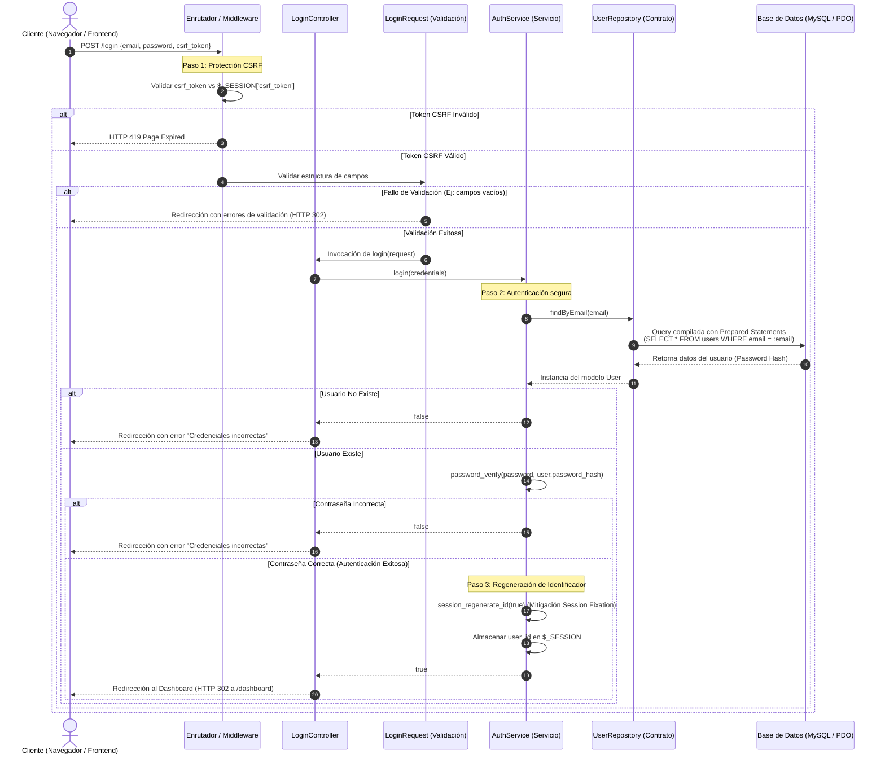

# Diagrama de Flujo: Proceso de Inicio de Sesión (Login)

Este documento detalla el flujo secuencial completo del proceso de autenticación de usuario (Inicio de Sesión) en la aplicación backend PHP con Laravel, desde la interacción en el Frontend hasta la verificación en la Base de Datos y la persistencia de la sesión.

---

## 1. Diagrama de Secuencia (Mermaid)

El siguiente diagrama ilustra la interacción entre los diferentes componentes del sistema durante el login:



---

## 2. Explicación Detallada de las Etapas

### 1. Envió del Formulario (Frontend)
El cliente completa los campos de `email` y `password` en el formulario visual. El formulario incluye obligatoriamente un campo oculto `_token` que contiene el token CSRF para prevenir ataques de falsificación de peticiones en sitios cruzados (OWASP A01).

### 2. Filtro CSRF (Middleware)
La petición HTTP es interceptada por el middleware de seguridad. Se ejecuta la validación utilizando comparación segura contra ataques de temporización (`hash_equals()` bajo el capó) entre el token enviado en la petición y el token persistido en el servidor en el arreglo de sesión:
```php
hash_equals($_SESSION['csrf_token'], $_POST['csrf_token'])
```

### 3. Validación de Entrada (Form Request)
Los campos son validados antes de llegar a la lógica de negocio para asegurar que cumplan las reglas básicas (email válido, password obligatorio, etc.), evitando procesamiento innecesario de peticiones malformadas.

### 4. Capa de Servicio y Repositorio (Persistencia)
El servicio `AuthService` solicita al repositorio de usuarios recuperar la entidad correspondiente al email recibido. La consulta a la base de datos se ejecuta de manera segura utilizando **Prepared Statements de PDO** para evitar cualquier tipo de inyección SQL (OWASP A03):
```sql
SELECT * FROM users WHERE email = :email LIMIT 1
```

### 5. Verificación Criptográfica de Contraseña
Una vez recuperado el usuario de la base de datos, se compara la contraseña de texto plano ingresada contra el hash (Argon2id) almacenado utilizando la función criptográfica nativa de PHP:
```php
password_verify($password, $user->password)
```
Esta función es segura contra ataques de temporización (*Timing Attacks*).

### 6. Prevención de Secuestro de Sesión y Login Exitoso
Si la verificación es correcta:
1.  Se llama de forma inmediata a la regeneración del identificador de sesión para mitigar vulnerabilidades de fijación de sesión (*Session Fixation*):
    ```php
    session_regenerate_id(true);
    ```
2.  Se almacena únicamente el identificador del usuario (`user_id`) en la sesión.
3.  El controlador responde con un redireccionamiento HTTP 302 al panel de control protegido (`/dashboard`).
